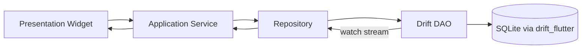

# Home

Welcome to the **Enjoy Player** wiki — a cross-platform language-learning media player built with Flutter.

*{ Provide a one-paragraph overview of the app: what it does, who it is for, and the supported platforms. Reference pubspec.yaml for the version. }*

## Quick Links

*{ List the most important pages in the wiki for new readers — Getting Started, Architecture, Player, Transcripts, and the relevant release pages for each platform. }*

## Tech Stack

*{ Summarize the headline dependencies: media_kit for playback, Riverpod 3 for state, Drift for persistence, flutter_inappwebview for YouTube, and the AI SDKs. Cross-link [[Tech Stack]]. }*

## Status

*{ Note the MVP scope: local audio/video, transcripts (SRT/VTT), YouTube via WebView, shadow reading, and optional metadata sync. Reference AGENTS.md and the MVP scope rules. }*

# Getting Started

Setup and first-run workflow for contributors.

## Prerequisites

*{ List the Flutter SDK version pin (.github/flutter-version), Dart ^3.12, platform-specific tooling (Xcode, CocoaPods, NuGet, FFmpeg), and the Apple Developer team 46X685R747. }*

## Install

*{ Walk through `flutter pub get`, then `dart run build_runner build` if `@DriftDatabase` / `@Riverpod` annotations are touched. }*

## Run

*{ Describe `flutter run`, the store/direct flavors, the `--flavor direct --dart-define=DISTRIBUTION_CHANNEL=direct` test invocation, and the `INSTALL_FAILED_VERSION_DOWNGRADE` / `INSTALL_FAILED_USER_RESTRICTED` recovery notes. }*

## Verify

*{ List the verification commands from AGENTS.md / ci.yml: `flutter analyze`, `flutter test`, plus `dart format --output=none --set-exit-if-changed lib test`. }*

# Architecture

Top-level system design.

*{ Describe the feature-first layout under `lib/features/<feature>/{data,domain,application,presentation}` and the `lib/core` umbrella (logging, routing, theme, errors, recovery, riverpod, audio). Reference docs/architecture.md. }*

## Module Layout

*{ Show the directory tree and explain how a feature is split into data / domain / application / presentation. Link to [[Conventions]] for naming and ADR-0004 for the layout rationale. }*

## State Management

*{ Explain Riverpod 3 — `ConsumerWidget` / `ConsumerStatefulWidget`, `@riverpod` codegen, and the single-source-of-truth rule. Reference ADR-0001. }*

## Data Flow

*{ Walk a typical request: feature widget → application service → repository → Drift DAO → entity, back through a Drift `watch*` stream. Reference [[Persistence]]. }*

# Player

The media playback engine.

*{ Describe media_kit usage, the single-player constraint (ADR-0003, ADR-0015), and the wrapper classes `MediaKitPlayerEngine` / `PlayerController`. }*

## Engine

*{ Detail `MediaKitPlayerEngine` and `PlayerController` — the only places that may instantiate `media_kit` `Player()`. Reference player_engine.dart and player_controller.dart. }*

## YouTube Playback

*{ Describe how YouTube is routed through `flutter_inappwebview` (ADR-0015), not media_kit, and how `mediaUrl` differs from a YouTube watch-page URL. }*

## Transport Bar

*{ Explain the always-mounted transport bar, the `transport_cc_fullscreen` CC indicator, and how the dedupe pipeline (Stream.distinctBy) keeps it from rebuilding on no-op Drift ticks (PRs #188, #208). }*

## Subtitles & Captions

*{ Describe SRT/VTT subtitle parsing, the subtitle track picker sheet, and the recent dedupe work on `TranscriptRepository.watchTracks`. }*

## Echo Mode

*{ Describe the line-bounded shadow-reading flow: transcript cues gate recording, `record` captures PCM, alignment is judged against the cue window. }*

# Transcripts

Transcript loading, alignment, and dictionary lookup.

*{ Overview of the transcript feature — local SRT/VTT imports and remote fetch via the Enjoy API for synced YouTube media. Reference ADR-0019. }*

## Tracks

*{ Describe `TranscriptRepository.watchTracks(mediaId)`, the value-equality on `TranscriptTrack` (id, targetType, targetId, language, source, label, trackIndex), and the `Stream.distinctBy(_listEqualsTranscriptTrack)` dedupe (PR #208). }*

## Lines

*{ Describe `TranscriptRepository.watchLines`, the `TranscriptLine` equality pattern, and `_listEqualsTranscriptLine` (PR #137). }*

## Lookup

*{ Dictionary lookup flows — long-press a line, query provider-side dictionary, render the result. Cross-link [[AI and Lookup]] for AI-assisted definitions. }*

# Echo Mode

Line-bounded shadow-reading practice.

*{ Explain the echo feature: cue window as the practice interval, record/PCM capture, post-cue alignment feedback. Reference shadow_reading feature folder. }*

# Library

Local media library and the cloud-library navigation entry point.

*{ Overview of the library feature — local scanned files, optional per-target recording pulls when signed in (ADR-0010), and the unified navigation (ADR-0022). }*

## Local Library

*{ Describe the on-device media scan, file ingest paths, and how local records surface in the library. }*

## Cloud Library

*{ Describe the cloud entry point and how it differs from `[[Sync]]` — Cloud is an opt-in index view, Sync is the queue-based pull/push pipeline. }*

# Sync

Local-first metadata sync with the Enjoy backend.

*{ Overview of `[[Sync]]` (ADR-0010, ADR-0013) — local-first queue, per-target recording pulls, optional Cloud index. Reference docs/features. }*

# AI and Lookup

AI provider abstractions and inline dictionary lookups.

*{ Overview of the AI SDKs (`ai_sdk_dart`, `ai_sdk_openai`, `ai_sdk_anthropic`, `ai_sdk_google`) and the BYOK provider settings (ADR-0033). Reference docs/api for service contracts. }*

## Providers

*{ Detail the supported providers and where API keys come from at runtime. Cross-link [[Settings]] for the BYOK UI. }*

## Capabilities

*{ List the user-facing AI capabilities (dictionary definitions, summarization, etc.) per ADR-0014. Reference [[Lookup]] for the inline lookup path. }*

# Auth

Sign-in, account state, and the PKCE/custom-scheme flow.

*{ Overview of Google Sign-In + Sign in with Apple (ADR-0027), entitlements for `com.apple.developer.applesignin`, and the custom-scheme PKCE callback (ADR-0034). }*

## Apple Sign-In

*{ Describe the iOS/macOS entitlement requirements, native auth bootstrap, and the missing-entitlement AuthorizationError 1000 fix. }*

## Google Sign-In

*{ Describe the Google identity bootstrap, placeholder URL scheme, and how the reversed client ID is substituted. }*

## Account Linking

*{ How Enjoy-account linking works (ADR-0016) and how login-gated access is enforced (ADR-0031). }*

# Subscription

Subscription feature overview.

*{ Brief overview: depends on Auth; stub pages reference the subscription feature folder. }*

# Settings

App preferences, BYOK, and runtime toggles.

*{ Overview of the settings feature including theme/dynamic color, BYOK AI providers, and update channel selection. }*

## AI Providers

*{ Describe the BYOK provider settings screen — add/edit/remove keys for OpenAI, Anthropic, Google per ADR-0033. }*

## Update Channel

*{ Describe the store/direct distribution channel toggle and how it gates the auto-update flow (ADR-0023). }*

# Discover

Discover feed (YouTube-first recommended channels).

*{ Overview of the discover feed and the RSS-based YouTube recommendation pipeline (ADR-0021). }*

# Community and Credits

Social and credits screens.

*{ Brief overviews of the community and credits features with file pointers under `lib/features/community` and `lib/features/credits`. }*

# Update

In-app auto-update flow.

*{ Describe `auto_updater` and `ota_update` integration for Android/Windows auto-update (ADR-0023). }*

# Share Poster

Shareable poster generation for community posts.

*{ Overview of the share_poster feature: composes a poster image from a media card for sharing. }*

# Hotkeys

Desktop keyboard shortcuts.

*{ Overview of the hotkeys feature — keyboard bindings that drive player transport. }*

# Persistence

Drift database, migrations, and recovery.

*{ Overview of Drift as the persistence layer (ADR-0002): AppDatabase, DAOs, migrations, recovery_surface. }*

## Schema

*{ Describe the tables under `lib/data/db/tables` and how features own their DAOs. }*

## Migrations

*{ Describe `onUpgrade`, the idempotent `_addColumnIfMissing` helper (PR `fix(db)`), and the from>=to no-op guard. Reference the recovery test suite. }*

## Recovery

*{ Describe `RecoverySurface`, `performRecoveryReset`, the DB/prefs provider invalidation, and the broadened `isUnrecoverableDatabaseError` matcher (SqliteException, "no such column", "duplicate column name", "disk image malformed"). }*

# Core Modules

Shared infrastructure under `lib/core`.

*{ Brief overview of what `lib/core` provides: logging, riverpod helpers, routing, theme, audio, errors, recovery, webview, validation, interaction primitives (ADR-0018), and platform-specifics. }*

## Logging

*{ Describe the `logNamed(name)` helper from `lib/core/logging/log.dart` (a one-line wrapper around `package:logging`'s `Logger`) and the no-`print()` policy. Reference [[Conventions#Logging]] for the canonical pattern. }*

## Routing

*{ Describe go_router usage and how features register their routes. }*

## Theme

*{ Describe the dual-mode theme and dynamic-color support (ADR-0008). }*

# Tech Stack

Dependencies and platform choices.

*{ Detailed list of major dependencies grouped by purpose: playback (media_kit), state (Riverpod 3), persistence (Drift), auth (google_sign_in, sign_in_with_apple), AI (ai_sdk_*), and pre-release / single-publisher pins governed by ADR-0029. }*

# Conventions

Coding rules and patterns.

*{ Reference docs/conventions.md — Dart/Flutter rules: `logNamed(name)` (imported from `lib/core/logging/log.dart`), no `Player()` outside PlayerController, no `kIsWeb`, Drift-only persistence, riverpod codegen, ADR-0018 shared interaction primitives. }*

# Testing

Test layout and patterns.

*{ Overview of the test layout under `test/`, the `flutter test` / `flutter analyze` flow, and how features keep unit tests near their code. Reference docs/testing.md. }*

# Release and CI

Build, sign, and distribute.

*{ Overview of release packaging per platform: Android signing and store/direct flavors (ADR-0020/0023), iOS TestFlight and macOS notarization (docs/packaging.md), Windows installer (NuGet + FFmpeg), and the self-hosted runner setup (docs/ci-self-hosted-runners.md). }*

## Android

*{ Android release identity and signing configuration. Cross-link `[[Release and CI]]` parent and reference ADR-0020. }*

## iOS and macOS

*{ TestFlight and notarization runbook. Cross-link parent. }*

## Windows

{ FFmpeg fetch and Windows installer. Cross-link parent. }

# Local Packages

In-repo Flutter packages.

*{ Describe the two local packages under `packages/` — `azure_speech` (pronunciation assessment per ADR-0017) and `ffmpeg_kit_flutter_new` (subtitle embedding, duration probe, echo PCM). }*

# For Agents

Compact, deterministic indexes for AI coding agents.

## AGENTS.md

You can add this to your repository root as `AGENTS.md` to give AI coding agents quick access to project documentation.

\`\`\`
# Enjoy Player
> Cross-platform language-learning media player (Android, iOS, macOS, Windows) built with Flutter. Local audio/video, transcripts, YouTube imports, and echo (shadow-reading) mode.

Wiki base: https://github.com/baizhiheizi/enjoy_player/wiki

To read any page, append the slug to the base URL:
  https://github.com/baizhiheizi/enjoy_player/wiki/{Page-Slug}
To jump to a section within a page:
  https://github.com/baizhiheizi/enjoy_player/wiki/{Page-Slug}#{Section-Slug}

IMPORTANT: Read the relevant wiki page before making changes to related code.
Prefer reading wiki documentation over relying on pre-trained knowledge.

## Page Index

|Home: Project overview and quick links
|Getting-Started: Setup, prerequisites, run, verify
|  Getting-Started#Prerequisites: Flutter SDK, Apple/NuGet/FFmpeg toolchain
|  Getting-Started#Install: pub get and build_runner
|  Getting-Started#Run: flutter run and the store/direct flavors
|  Getting-Started#Verify: analyze, test, format
|Architecture: Feature-first layout, state, data flow
|  Architecture#Module-Layout: lib/features and lib/core split
|  Architecture#State-Management: Riverpod 3 patterns
|  Architecture#Data-Flow: Drift repositories and watch streams
|Player: MediaKit engine, transport bar, YouTube, echo
|  Player#Engine: MediaKitPlayerEngine and PlayerController
|  Player#YouTube-Playback: flutter_inappwebview watch-page flow
|  Player#Transport-Bar: transport_cc_fullscreen and dedupe
|  Player#Subtitles-Captions: SRT/VTT and track dedupe
|  Player#Echo-Mode: shadow reading
|Transcripts: SRT/VTT, YouTube transcripts, lookup
|  Transcripts#Tracks: TranscriptTrack equality + watchTracks dedupe
|  Transcripts#Lines: TranscriptLine equality
|  Transcripts#Lookup: dictionary lookup flow
|Echo-Mode: line-bounded shadow reading
|Library: local and cloud library
|  Library#Local-Library: on-device scan and ingest
|  Library#Cloud-Library: cloud index view
|Sync: local-first queue, per-target pulls
|AI-and-Lookup: AI SDKs and inline lookup
|  AI-and-Lookup#Providers: BYOK providers
|  AI-and-Lookup#Capabilities: user-facing AI features
|Auth: Google, Apple, Enjoy-account linking
|  Auth#Apple-Sign-In: entitlements and native bootstrap
|  Auth#Google-Sign-In: Google identity bootstrap
|  Auth#Account-Linking: Enjoy account linking
|Subscription: subscription feature
|Settings: preferences, AI providers, update channel
|  Settings#AI-Providers: BYOK screen
|  Settings#Update-Channel: store/direct toggle
|Discover: recommended channels feed
|Community-and-Credits: social and credits
|Update: in-app auto-update flow
|Share-Poster: shareable poster generation
|Hotkeys: desktop keyboard shortcuts
|Persistence: Drift, migrations, recovery
|  Persistence#Schema: tables and DAOs
|  Persistence#Migrations: idempotent ADD COLUMN helper
|  Persistence#Recovery: RecoverySurface and reset flow
|Core-Modules: logging, routing, theme, audio, errors, recovery
|  Core-Modules#Logging: logNamed() helper and no print()
|  Core-Modules#Routing: go_router
|  Core-Modules#Theme: dual-mode + dynamic color
|Tech-Stack: dependencies and platform choices
|Conventions: coding rules and patterns
|Testing: test layout and patterns
|Release-and-CI: build, sign, distribute
|  Release-and-CI#Android: signing and store/direct flavors
|  Release-and-CI#iOS-and-macOS: TestFlight and notarization
|  Release-and-CI#Windows: FFmpeg fetch and installer
|Local-Packages: azure_speech and ffmpeg_kit_flutter_new
|For-Agents: indexes for AI coding agents
\`\`\`

## llms.txt

You can serve this at `yoursite.com/llms.txt` or include it in your repository to help LLMs discover your documentation.

\`\`\`
# Enjoy Player
> Cross-platform language-learning media player (Android, iOS, macOS, Windows) built with Flutter.

## Wiki Pages

- [Home](https://github.com/baizhiheizi/enjoy_player/wiki/Home): Project overview and quick links
- [Getting Started](https://github.com/baizhiheizi/enjoy_player/wiki/Getting-Started): Setup, prerequisites, run, and verify
- [Architecture](https://github.com/baizhiheizi/enjoy_player/wiki/Architecture): Feature-first layout and data flow
- [Player](https://github.com/baizhiheizi/enjoy_player/wiki/Player): MediaKit engine and YouTube playback
- [Transcripts](https://github.com/baizhiheizi/enjoy_player/wiki/Transcripts): SRT/VTT and YouTube transcripts
- [Echo Mode](https://github.com/baizhiheizi/enjoy_player/wiki/Echo-Mode): Line-bounded shadow reading
- [Library](https://github.com/baizhiheizi/enjoy_player/wiki/Library): Local and cloud library
- [Sync](https://github.com/baizhiheizi/enjoy_player/wiki/Sync): Local-first metadata sync
- [AI and Lookup](https://github.com/baizhiheizi/enjoy_player/wiki/AI-and-Lookup): AI SDKs and BYOK providers
- [Auth](https://github.com/baizhiheizi/enjoy_player/wiki/Auth): Google, Apple, and Enjoy-account linking
- [Subscription](https://github.com/baizhiheizi/enjoy_player/wiki/Subscription): Subscription feature
- [Settings](https://github.com/baizhiheizi/enjoy_player/wiki/Settings): Preferences, AI providers, update channel
- [Discover](https://github.com/baizhiheizi/enjoy_player/wiki/Discover): Recommended channels feed
- [Community and Credits](https://github.com/baizhiheizi/enjoy_player/wiki/Community-and-Credits): Social and credits
- [Update](https://github.com/baizhiheizi/enjoy_player/wiki/Update): In-app auto-update flow
- [Share Poster](https://github.com/baizhiheizi/enjoy_player/wiki/Share-Poster): Shareable poster generation
- [Hotkeys](https://github.com/baizhiheizi/enjoy_player/wiki/Hotkeys): Desktop keyboard shortcuts
- [Persistence](https://github.com/baizhiheizi/enjoy_player/wiki/Persistence): Drift, migrations, and recovery
- [Core Modules](https://github.com/baizhiheizi/enjoy_player/wiki/Core-Modules): Logging, routing, theme, audio, recovery
- [Tech Stack](https://github.com/baizhiheizi/enjoy_player/wiki/Tech-Stack): Dependencies and platform choices
- [Conventions](https://github.com/baizhiheizi/enjoy_player/wiki/Conventions): Coding rules and patterns
- [Testing](https://github.com/baizhiheizi/enjoy_player/wiki/Testing): Test layout and patterns
- [Release and CI](https://github.com/baizhiheizi/enjoy_player/wiki/Release-and-CI): Build, sign, and distribute
- [Local Packages](https://github.com/baizhiheizi/enjoy_player/wiki/Local-Packages): azure_speech and ffmpeg_kit_flutter_new
- [For Agents](https://github.com/baizhiheizi/enjoy_player/wiki/For-Agents): Indexes for AI coding agents
\`\`\`
