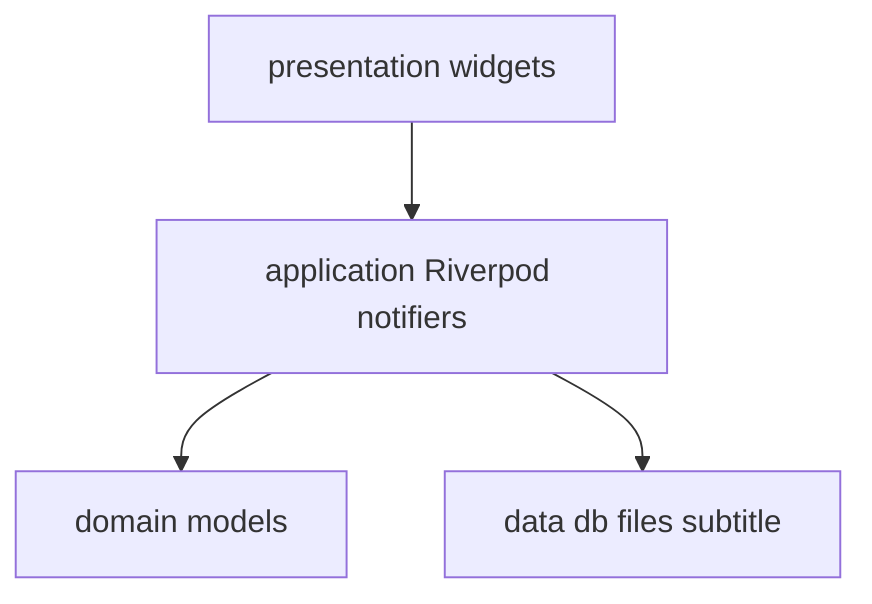
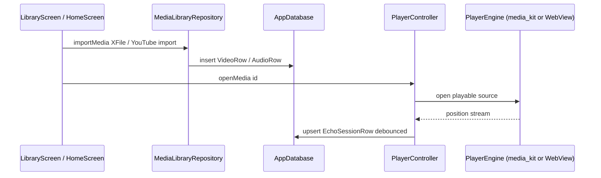

# Architecture

## Goals

- **Feature-first** folders under `lib/features/*` with shared `lib/core` and `lib/data`.
- **One `media_kit` `Player`** owned by [`MediaKitPlayerEngine`](../lib/features/player/application/player_engine.dart) for local/URL decode paths; **YouTube** uses a separate WebView engine (ADR-0003, ADR-0015).
- **Drift** as single local SQLite source of truth (ADR-0002).
- **Riverpod 3** for app state; codegen via `riverpod_annotation` where practical (ADR-0001).

## Layer map

## Runtime flow (MVP)

## Drift tables (summary)

| Table | Purpose |
|-------|---------|
| `videos` | Local video URI, `vid` hash, duration (seconds), sync metadata |
| `audios` | Local audio URI, `aid` hash, duration, optional TTS fields, sync metadata |
| `transcripts` | `targetType` + `targetId` (weapp-style), JSON `timeline`, sync metadata |
| `echo_sessions` | Playback + echo window + primary/secondary transcript ids per target |
| `recordings` | Pronunciation recordings (sync-ready); time fields `duration`, `referenceStart`, `referenceDuration` in ms, aligned with API |
| `dictations` | Dictation attempts (sync-ready) |
| `sync_queue` | Offline-first outbound sync queue (`SyncCtrl` + [`features/sync.md`](features/sync.md)) |
| `settings` | Key/value JSON blobs (player prefs, hotkeys, **main API base URL**, **AI/Worker API base URL**, **auth profile cache**, app locale prefs) |

### Schema upgrades (release note)

[`AppDatabase`](../lib/data/db/app_database.dart) uses **destructive** `onUpgrade` for schema versions below 6. **v6 → v7** adds Discover tables incrementally without wiping library data. Older upgrades still drop listed tables and recreate them. Plan releases accordingly.

### Per-user database cache

`app_database_provider.dart` keeps the most recent **two** per-user [`AppDatabase`](../lib/data/db/app_database.dart) instances in a bounded `LinkedHashMap`. On sign-in for a third account, the **oldest** entry is closed (and its Drift connections released) before the new one is inserted — see [ADR-0012](decisions/0012-per-user-sqlite-isolation.md) for the per-user isolation rationale. The cap keeps the file-handle / mmap footprint stable across guest ↔ account churn.

#### `transcript_fetch_states` index follow-up

The `transcript_fetch_states` lookup path is currently a sequential scan over `(target_type, target_id)`. A composite index on those two columns is a planned follow-up; track the schema change against the next `onUpgrade` so the index is added without dropping the table.

## Optional Enjoy account (auth)

- **HTTP:** `package:http` + small `ApiClient` under `lib/data/api/` (camelCase ↔ snake_case like `@enjoy/api`).
- **Tokens:** `flutter_secure_storage` (access token only).
- **Browser sign-in:** `url_launcher` for `start_auth` / `poll` flow ([ADR-0006](decisions/0006-auth-and-profile-sync.md), [features/auth.md](features/auth.md)).
- **Cloud metadata sync:** when signed in, [`SyncCtrl`](../lib/features/sync/application/sync_controller.dart) runs re-key for offline imports, drains `sync_queue`, and (when signed in and the player opens media) pulls recording metadata per target — see [ADR-0013](decisions/0013-local-first-sync.md), [features/sync.md](features/sync.md), [features/cloud.md](features/cloud.md).

## Routing

[`GoRouter`](../lib/core/routing/app_router.dart) + [`ShellRoute`](../lib/features/player/presentation/root_shell.dart): routes render beside an extended sidebar at wide breakpoints; [`GlobalTransportBar`](../lib/features/player/presentation/widgets/global_transport_bar.dart) spans the bottom when a playback session exists. An **`errorBuilder`** at the router root renders [`NotFoundScreen`](../lib/core/routing/not_found_screen.dart) (localized en / zh / zh-CN) for unknown locations; the screen surfaces the attempted URI and offers a single primary action to return to `/`.

## Manual providers

[`libraryMediaProvider`](../lib/features/library/application/library_media_provider.dart) is a hand-written `StreamProvider` because `riverpod_generator` + Drift row types hit an `InvalidTypeException` in codegen — keep this pattern documented if more stream providers need the same workaround.

## Main-isolate performance (Windows)

- **Do not** run `palette_generator` / heavy image analysis per item in large `GridView` / `ListView` builders on the UI isolate — see [features/library.md](features/library.md) § *Performance (signed-in cold start, Windows)*. Use Flutter DevTools **CPU profiler** on the UI thread when investigating jank or “Not responding” during scroll or startup.
