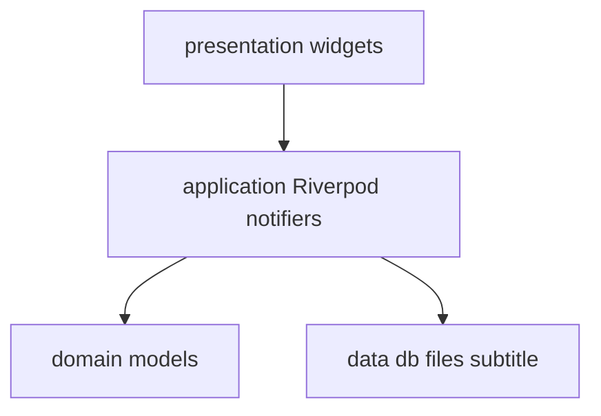
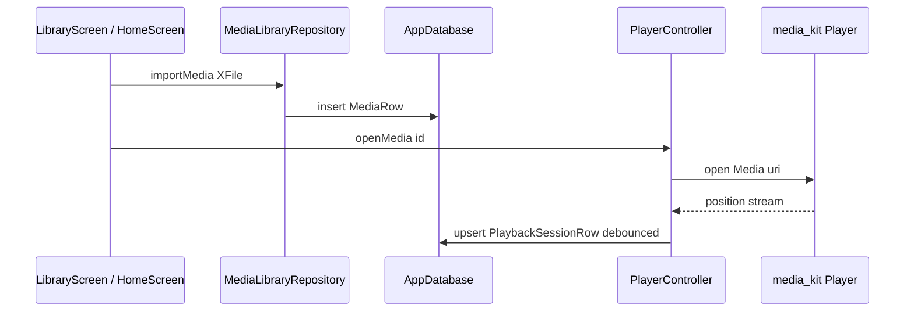

# Architecture

## Goals

- **Feature-first** folders under `lib/features/*` with shared `lib/core` and `lib/data`.
- **One `media_kit` `Player`** owned by [`PlayerController`](../lib/features/player/application/player_controller.dart) (ADR-0003).
- **Drift** as single local SQLite source of truth (ADR-0002).
- **Riverpod 3** for app state; codegen via `riverpod_annotation` where practical (ADR-0001).

## Layer map

## Runtime flow (MVP)

## Drift tables (summary)

| Table | Purpose |
|-------|---------|
| `media` | Local file URI, hash, kind, duration |
| `transcripts` | JSON lines per media |
| `playback_sessions` | Position + echo window (keyed by `mediaId`) |
| `settings` | Key/value JSON blobs (player prefs) |

## Routing

[`GoRouter`](../lib/core/routing/app_router.dart) + [`ShellRoute`](../lib/features/player/presentation/root_shell.dart): routes render beside an extended sidebar at wide breakpoints; [`GlobalTransportBar`](../lib/features/player/presentation/widgets/global_transport_bar.dart) spans the bottom when a playback session exists.

## Manual providers

[`libraryMediaProvider`](../lib/features/library/application/library_media_provider.dart) is a hand-written `StreamProvider` because `riverpod_generator` + Drift row types hit an `InvalidTypeException` in codegen — keep this pattern documented if more stream providers need the same workaround.
