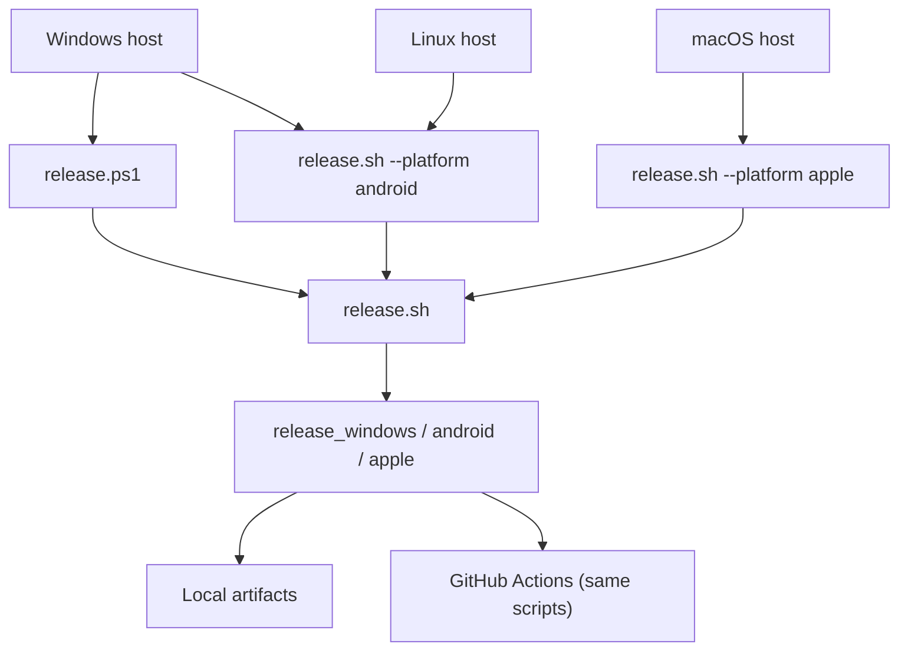

# Release & packaging

**Verify releases locally first.** GitHub Actions workflows call the same scripts you run on your machine.

## Quick start

1. Bump `version:` in [`pubspec.yaml`](../pubspec.yaml).
2. Run the release script for your platform (see [Host matrix](#host-matrix) below).
3. Confirm artifacts in the [output paths](#artifacts).
4. When ready, wire up CI — see [GitHub Actions](#github-actions-later).

---

## Release model



| Script | Role |
|--------|------|
| [`release.ps1`](../release.ps1) | Windows entry point (delegates to `release.sh` via Git Bash) |
| [`.github/scripts/release.sh`](../.github/scripts/release.sh) | Platform dispatcher |
| [`.github/scripts/release_windows.sh`](../.github/scripts/release_windows.sh) | Windows build + installer |
| [`.github/scripts/release_android.sh`](../.github/scripts/release_android.sh) | Play AAB + sideload APKs |
| [`.github/scripts/release_apple.sh`](../.github/scripts/release_apple.sh) | iOS IPA + macOS zip (macOS host only) |

---

## Host matrix

| Host | Platforms | Command |
|------|-----------|---------|
| **Windows** | Windows installer | `pwsh ./release.ps1` |
| **Windows** | Android (AAB + APKs) | `pwsh ./release.ps1 -Platform android` |
| **Linux** | Android (AAB + APKs) | `bash .github/scripts/release.sh --platform android` |
| **macOS** | iOS + macOS | `bash .github/scripts/release.sh --platform apple --notarize` |

### Common flags

| Flag (PowerShell) | Flag (bash) | Effect |
|-------------------|-------------|--------|
| `-SkipChecks` | `--skip-checks` | Skip `flutter analyze` / `flutter test` |
| `-PublishOnly -Publish` | `--publish-only --publish` | Re-upload existing artifacts |
| `-Publish` | `--publish` | Build + upload to `dl.enjoy.bot` |
| `-FeedsOnly` | `--feeds-only` | Build local update feeds only (no S3) |

Apple-only flags: `--notarize` (macOS direct download), `--testflight` (upload IPA).

---

## One-time setup

### All platforms

```bash
flutter pub get
```

Pre-release checks (also run automatically unless `--skip-checks`):

```bash
dart format --output=none --set-exit-if-changed .
flutter analyze
flutter test
```

### Windows

- **Git for Windows** (Git Bash) — required by `release.ps1`
- **PowerShell 7+** (`pwsh`)
- **NuGet CLI** on `PATH` — WebView2 native restore ([README](../README.md))
- **Inno Setup 6** — installer build (script can install via Chocolatey on CI)

### Linux (Android)

- **Flutter** + **Android SDK** (Java 17)
- After `flutter pub get`, run [`tool/patch_agp9_pub_plugins.sh`](../tool/patch_agp9_pub_plugins.sh) (done automatically by release script)

### macOS (Apple)

- **Xcode** + **CocoaPods** + Apple Developer team **`46X685R747`**
- **Homebrew** + FFmpeg deps: `brew bundle install --file=macos/Brewfile`
- **Notary credentials** (for `--notarize`): `xcrun notarytool store-credentials "enjoy-notary" …`

### Android signing

1. Create an upload keystore (keep out of git).
2. Copy [`android/key.properties.example`](../android/key.properties.example) → **`android/key.properties`** (gitignored).
3. Fill `storePassword`, `keyPassword`, `keyAlias`, `storeFile` (`storeFile` is relative to `android/`).

**Without `key.properties`, release builds use the debug keystore — do not upload those to Play.**

### Apple signing

- **Bundle ID**: `ai.enjoy.player` (ADR-0020)
- iOS: automatic signing in Xcode; export via [`ios/ExportOptions.export.plist`](../ios/ExportOptions.export.plist)
- macOS direct download: Developer ID Application + notarization (not Mac App Store)

### Publish credentials (optional)

Only needed when uploading to `dl.enjoy.bot`:

```powershell
# Windows
Copy-Item .github\scripts\publish_env.example.ps1 .github\scripts\publish_env.local.ps1
# edit values, then:
pwsh ./release.ps1 -Publish
```

```bash
# macOS / Linux / Git Bash
cp .github/scripts/publish_env.example.sh .github/scripts/publish_env.local.sh
# edit values, then:
bash .github/scripts/release.sh --platform windows --publish
```

---

## Local release commands

### Windows installer

```powershell
pwsh ./release.ps1                      # checks + build + installer
pwsh ./release.ps1 -SkipChecks          # faster iteration
```

Builds: `flutter build windows --release`, fetches FFmpeg, runs Inno Setup.

### Android (Windows or Linux)

```powershell
# Windows
pwsh ./release.ps1 -Platform android
```

```bash
# Linux (or Git Bash)
bash .github/scripts/release.sh --platform android
```

Builds:

- **Play AAB**: `flutter build appbundle --release --flavor store`
- **Sideload APKs**: `flutter build apk --release --split-per-abi --flavor direct --dart-define=DISTRIBUTION_CHANNEL=direct`

### iOS + macOS (macOS host only)

```bash
bash .github/scripts/release.sh --platform apple --notarize --testflight
```

Builds iOS IPA, uploads to TestFlight (if API credentials are set), builds macOS `.app`, notarizes, zips.

---

## Artifacts

Version comes from `pubspec.yaml` (`version: 0.1.0+1` → `0.1.0` in filenames).

| Platform | Output (example at `0.1.0`) |
|----------|-------------------------------|
| Windows installer | `build/windows/installer/EnjoyPlayerSetup-v0.1.0.exe` |
| Android (Play) | `build/app/outputs/bundle/release/EnjoyPlayer-v0.1.0.aab` |
| Android (sideload) | `build/app/outputs/flutter-apk/EnjoyPlayer-v0.1.0-arm64-v8a.apk` (+ `armeabi-v7a`, `x86_64`) |
| iOS | `build/ios/ipa/EnjoyPlayer-v0.1.0.ipa` |
| macOS | `EnjoyPlayer-macOS-v0.1.0.zip` (repo root) |

After a successful run, scripts print artifact paths. For manual rename only:

```bash
bash .github/scripts/rename_release_artifacts.sh android   # after flutter build
bash .github/scripts/rename_release_artifacts.sh apple
```

---

## Distribution channels

| Artifact | Channel | Auto-update |
|----------|---------|-------------|
| Play AAB (`store` flavor) | Google Play | No |
| Sideload APK (`direct` flavor) | Direct download | Yes (`ota_update`) |
| Windows installer | Direct download | Yes (WinSparkle) |
| macOS zip | Direct download | Yes (Sparkle) |
| iOS IPA | TestFlight / App Store | No |

Direct builds check `https://dl.enjoy.bot/player/latest.json` (ADR-0023). Store builds do not.

---

## Publish to dl.enjoy.bot (optional)

Skip this until local builds work. When ready:

```powershell
pwsh ./release.ps1 -Publish             # Windows: build + upload
pwsh ./release.ps1 -PublishOnly -Publish # re-upload existing installer
```

```bash
bash .github/scripts/release.sh --platform android --publish
bash .github/scripts/release.sh --platform apple --publish-only --publish
```

**Test auto-update locally (no S3):**

```powershell
pwsh ./release.ps1 -FeedsOnly
cd build/release/serve && python -m http.server 8787
# feeds at http://127.0.0.1:8787/player
```

Sparkle / WinSparkle keys: see [ADR-0023](decisions/0023-app-update-distribution.md). Verify wiring:

```bash
bash .github/scripts/verify_sparkle_setup.sh
```

---

## GitHub Actions (later)

After local verification, enable CI. Each workflow calls the same platform script.

| Workflow | Runner | Local equivalent |
|----------|--------|------------------|
| [`release_windows.yml`](../.github/workflows/release_windows.yml) | `windows-latest` | `pwsh ./release.ps1` |
| [`release_android.yml`](../.github/workflows/release_android.yml) | self-hosted Linux | `bash .github/scripts/release.sh --platform android` |
| [`release_apple.yml`](../.github/workflows/release_apple.yml) | self-hosted macOS | `bash .github/scripts/release.sh --platform apple --notarize --testflight` |

Trigger: push tag `v*` or manual workflow dispatch.

Platform CI setup (secrets, runners):

- [windows-release-ci.md](windows-release-ci.md)
- [android-release-ci.md](android-release-ci.md)
- [apple-release-ci.md](apple-release-ci.md)
- [ci-self-hosted-runners.md](ci-self-hosted-runners.md)

---

## Troubleshooting

### Android

- **Debug-signed AAB/APK**: missing `android/key.properties` — create from example and rebuild.
- **Gradle / `dl.google.com` TLS**: mirrors are in [`settings.gradle.kts`](../android/settings.gradle.kts); use JDK 17; check VPN/proxy.
- **AGP 9 plugin errors**: run `tool/patch_agp9_pub_plugins.ps1` (Windows) or `tool/patch_agp9_pub_plugins.sh` (Linux/macOS) after `flutter pub get`.

### Windows

- **`release.ps1` needs Git Bash**: install [Git for Windows](https://git-scm.com/download/win); WSL bash is not supported.
- **NuGet / WebView2 restore fails**: ensure `nuget` on PATH with `nuget.org` source — see [README](../README.md).
- **Missing FFmpeg features**: run `pwsh windows/scripts/fetch_ffmpeg.ps1` before build.
- **WebView2**: required at runtime for YouTube / in-app WebView.

### Apple

- **macOS DYLD / missing `libz.1.dylib`**: run `brew bundle install --file=macos/Brewfile` and rebuild.
- **Keychain / signing on new Mac**: open `macos/Runner.xcworkspace`, enable automatic signing, team `46X685R747`, build once in Xcode.
- **Notarization fails**: check `NOTARY_PROFILE` (default `enjoy-notary`) and stored credentials.
- **TestFlight skipped**: set App Store Connect API env vars or upload IPA manually via Transporter.

### General

- **Stale `build/release/pubspec.yaml`**: causes `flutter analyze` path errors — release scripts prune these automatically.
- **Hot restart on macOS**: unreliable with native stack; use hot reload or full restart.

---

## Platform reference

Identity: **`ai.enjoy.player`** everywhere ([ADR-0020](decisions/0020-android-windows-release-identity.md)).

| Platform | Min target | Notes |
|----------|------------|-------|
| Android | minSdk 26, Java 17 | AGP 9; vendored `ffmpeg_kit_flutter_new` |
| iOS | 14.0 | `use_frameworks!` for Azure Speech, FFmpeg |
| macOS | 10.15 | App Sandbox on; GPL FFmpeg bundled |
| Windows | x64 | Authenticode signing outside repo |

Further reading: [architecture.md](architecture.md), [testing.md](testing.md), platform folders under `android/`, `ios/`, `macos/`, `windows/`.
