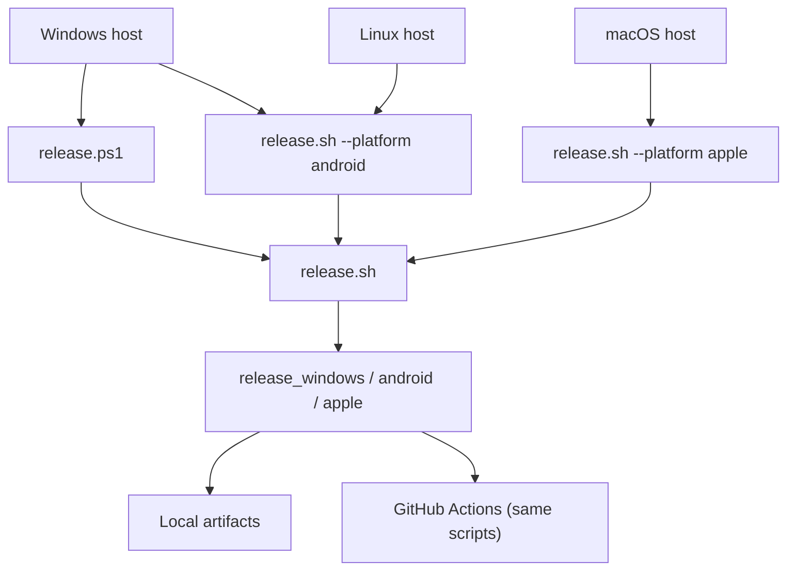

# Release & packaging

**Verify releases locally first.** GitHub Actions workflows call the same scripts you run on your machine.

## How users get the app

The public download page is at **[https://get.enjoy.bot](https://get.enjoy.bot)**. It detects the visitor's OS and surfaces the correct install action:

| Platform | Install path |
|----------|-------------|
| Windows | Direct download — `.exe` installer from `dl.enjoy.bot` |
| macOS | Direct download — notarized `.zip` from `dl.enjoy.bot` |
| Android | APK sideload from `dl.enjoy.bot` **or** Play Store beta enrollment |
| iOS | TestFlight beta invitation |

The page reads the current version from the release manifest (`dl.enjoy.bot/player/latest.json`) via a same-origin proxy, so download links update automatically after each release. Store/TestFlight links are configured in [`landing/config.js`](../landing/config.js).

See [ADR-0024](decisions/0024-download-landing-page.md) for hosting decisions and [Cloudflare Pages deploy](#landing-page-deploy) below for the deploy pipeline.

---

## Quick start

1. Bump `version:` in [`pubspec.yaml`](../pubspec.yaml) and update [`CHANGELOG.md`](../CHANGELOG.md).
2. Sync platform metadata: `bash .github/scripts/sync_release_version.sh` (Windows installer; Android/iOS/macOS read pubspec at build).
3. Run the release script for your platform (see [Host matrix](#host-matrix) below).
4. Confirm artifacts in the [output paths](#artifacts).
5. When ready, wire up CI — see [GitHub Actions](#github-actions-later).

---

## Release model



| Script | Role |
|--------|------|
| [`release.ps1`](../release.ps1) | Windows entry point (delegates to `release.sh` via Git Bash) |
| [`.github/scripts/release.sh`](../.github/scripts/release.sh) | Platform dispatcher |
| [`.github/scripts/release_windows.sh`](../.github/scripts/release_windows.sh) | Windows build + installer |
| [`.github/scripts/release_android.sh`](../.github/scripts/release_android.sh) | Play AAB + sideload APKs |
| [`.github/scripts/release_apple.sh`](../.github/scripts/release_apple.sh) | iOS IPA + macOS zip (macOS host only) |

---

## Host matrix

| Host | Platforms | Command |
|------|-----------|---------|
| **Windows** | Windows installer | `pwsh ./release.ps1` |
| **Windows** | Android (AAB + APKs) | `pwsh ./release.ps1 -Platform android` |
| **Linux** | Android (AAB + APKs) | `bash .github/scripts/release.sh --platform android` |
| **macOS** | iOS + macOS | `bash .github/scripts/release.sh --platform apple --notarize` |
| **macOS** | macOS zip only | `bash .github/scripts/release.sh --platform apple --macos-only --notarize` |

### Common flags

| Flag (PowerShell) | Flag (bash) | Effect |
|-------------------|-------------|--------|
| `-SkipChecks` | `--skip-checks` | Skip `flutter analyze` / `flutter test` |
| `-PublishOnly -Publish` | `--publish-only --publish` | Re-upload existing artifacts (no build, no checks) |
| `-Publish` | `--publish` | Build + upload to `dl.enjoy.bot` |
| `-FeedsOnly` | `--feeds-only` | Build local update feeds only (no S3) |

Apple-only flags: `--notarize` (macOS direct download), `--testflight` (upload IPA), `--macos-only` (skip iOS build).

---

## One-time setup

### All platforms

```bash
flutter pub get
```

Pre-release checks (also run automatically unless `--skip-checks`):

```bash
dart format --output=none --set-exit-if-changed .
flutter analyze
flutter test
```

### Windows

- **Git for Windows** (Git Bash) — required by `release.ps1`
- **PowerShell 7+** (`pwsh`)
- **NuGet CLI** on `PATH` — WebView2 native restore ([README](../README.md))
- **Inno Setup 6** — installer build (script can install via Chocolatey on CI)

### Linux (Android)

- **Flutter** + **Android SDK** (Java 17)
- After `flutter pub get`, run [`tool/patch_agp9_pub_plugins.sh`](../tool/patch_agp9_pub_plugins.sh) (done automatically by release script)

### macOS (Apple)

- **Xcode** + **CocoaPods** + Apple Developer team **`46X685R747`**
- **Homebrew** + FFmpeg deps: `brew bundle install --file=macos/Brewfile`
- **App Store Connect app** for bundle ID `ai.enjoy.player` (required for full `--platform apple` runs that build iOS)
- **Keychain certs**: Apple Distribution (iOS / TestFlight) and Developer ID Application (macOS direct download)
- **Notary credentials** (for `--notarize`), either:
  - **Local (Apple ID)**: store an app-specific password in Keychain as `AC_PASSWORD`, then:
    ```bash
    xcrun notarytool store-credentials "enjoy-notary" \
      --apple-id "you@example.com" \
      --team-id "46X685R747" \
      --password "@keychain:AC_PASSWORD"
    ```
  - **API key** (CI / optional locally): set `APP_STORE_CONNECT_API_KEY_ID`, `APP_STORE_CONNECT_ISSUER_ID`, and `APP_STORE_CONNECT_API_PRIVATE_KEY` — the release script registers profile `enjoy-notary` automatically when `--notarize` is set
- **TestFlight upload** (for `--testflight`): same three `APP_STORE_CONNECT_*` env vars
- **Sparkle auto-update** (before `--publish`): run once on Mac — `dart run auto_updater:generate_keys`, **paste the printed `SUPublicEDKey` into [`macos/Runner/Info.plist`](../macos/Runner/Info.plist)** (private key stays in Keychain), then `bash .github/scripts/verify_sparkle_setup.sh`

### Android signing

1. Create an upload keystore (keep out of git).
2. Copy [`android/key.properties.example`](../android/key.properties.example) → **`android/key.properties`** (gitignored).
3. Fill `storePassword`, `keyPassword`, `keyAlias`, `storeFile` (`storeFile` is relative to `android/`).

**Without `key.properties`, release builds use the debug keystore — do not upload those to Play.**

### Apple signing

- **Bundle ID**: `ai.enjoy.player` (ADR-0020)
- iOS: automatic signing in Xcode; export via [`ios/ExportOptions.export.plist`](../ios/ExportOptions.export.plist)
- macOS direct download: compile unsigned, then **Developer ID Application** sign + notarization in post-steps (`build_macos_release.sh` + `notarize_release.sh`; Debug/Profile keep Apple Development for local runs)

### Publish credentials (optional)

Only needed when uploading to `dl.enjoy.bot`. Install **AWS CLI v2**:

- **macOS**: `brew install awscli`
- **Windows**: `winget install Amazon.AWSCLI`

Credentials are loaded into the shell environment from a **local, gitignored** file
(`publish_env.local.ps1` on Windows, `publish_env.local.sh` elsewhere) or, in CI,
from GitHub Actions secrets. **Never commit real AWS/R2 access keys or secret keys** —
the pre-commit hook ([`.githooks/pre-commit`](../.githooks/pre-commit)) blocks
credential-shaped strings (`AKIA…`, 64-hex R2 secrets) and the local credential
files themselves. If you have ever pasted real keys into a working-tree file,
**rotate them in Cloudflare R2** and start from a clean local copy.

#### Recommended secret sources

Prefer one of these over a plaintext working-tree file so credentials never touch
the repository disk:

| Source | When to use | How to load |
|--------|-------------|-------------|
| **GitHub Actions secrets** | CI releases | Reference as `${{ secrets.R2_ACCESS_KEY_ID }}` in the workflow; the workflow sets the same `AWS_*` / `PUBLISH_*` env vars |
| **Windows Credential Manager** | Local Windows releases | Read into the session before running `release.ps1`, e.g. via `cmdkey` or a vault CLI, exporting the same env vars |
| **1Password CLI** (`op`) | Any local host | `export AWS_SECRET_ACCESS_KEY="$(op read 'op://Private/r2/secret')"` etc. before `release.sh` |

The local `publish_env.local.*` loaders are a convenience for maintainers who
prefer a dotenv-style flow; keep them on disk only, never in git.

#### WinSparkle DSA private key

`sign_sparkle_enclosure.sh` resolves the DSA private key for Windows appcast
signing in this order:

1. `SPARKLE_DSA_PRIV_PEM` env var (an absolute path to the key file)
2. `SPARKLE_DSA_PRIV_PEM_BASE64` env var (base64-encoded key, decoded to a temp file)
3. `dsa_priv.pem` at the **repo root** (auto-detected — the recommended default)

Because the repo-root path is auto-detected, **do not hardcode an absolute path**
in your local env file. If the key lives elsewhere, resolve it relative to the
repo root:

```bash
# bash / macOS / Linux
export SPARKLE_DSA_PRIV_PEM="$(git rev-parse --show-toplevel)/keys/dsa_priv.pem"
```

```powershell
# PowerShell
$env:SPARKLE_DSA_PRIV_PEM = Join-Path (git rev-parse --show-toplevel) "keys/dsa_priv.pem"
```

CI injects the key as base64 via `SPARKLE_DSA_PRIV_PEM_BASE64` (see
[`sign_sparkle_enclosure.sh`](../.github/scripts/sign_sparkle_enclosure.sh)).

#### Local publish setup

```powershell
# Windows
Copy-Item .github\scripts\publish_env.example.ps1 .github\scripts\publish_env.local.ps1
# edit AWS_* / PUBLISH_* values, then:
pwsh ./release.ps1 -Publish

# Verify credentials (optional)
. .\.github\scripts\publish_env.local.ps1
aws s3 ls "s3://$env:PUBLISH_BUCKET/" --endpoint-url $env:AWS_ENDPOINT_URL_S3
```

```bash
# macOS / Linux / Git Bash
cp .github/scripts/publish_env.example.sh .github/scripts/publish_env.local.sh
# edit values, then:
bash .github/scripts/release.sh --platform apple --publish
```

#### Pre-commit secret scanning

After cloning, enable the local secret scanner so credential-shaped strings
and the local credential files cannot be committed by accident:

```bash
git config core.hooksPath .githooks
```

The hook scans staged content for AWS/R2 access key patterns and blocks the
forbidden local credential / key files outright. Bypass with `git commit --no-verify`
only for a known-good false positive (e.g. a hex test fixture), and note it in the
commit message.

---

## Local release commands

### Windows installer

```powershell
pwsh ./release.ps1                      # checks + build + installer
pwsh ./release.ps1 -SkipChecks          # faster iteration
```

Builds: `flutter build windows --release`, fetches FFmpeg, runs Inno Setup.

### Android (Windows or Linux)

```powershell
# Windows
pwsh ./release.ps1 -Platform android
```

```bash
# Linux (or Git Bash)
bash .github/scripts/release.sh --platform android
```

Builds:

- **Play AAB**: `flutter build appbundle --release --flavor store`
- **Sideload APKs**: `flutter build apk --release --split-per-abi --flavor direct --dart-define=DISTRIBUTION_CHANNEL=direct`

### iOS + macOS (macOS host only)

**macOS direct download** (fastest first local test — skips iOS):

```bash
bash .github/scripts/verify_macos_release_env.sh          # certs, keychain, Homebrew
bash .github/scripts/release.sh --platform apple --macos-only --notarize
bash .github/scripts/release.sh --platform apple --macos-only --notarize --skip-checks  # iteration
```

**Full Apple release** (iOS IPA + TestFlight when API env is set + notarized macOS zip):

```bash
bash .github/scripts/release.sh --platform apple --notarize --testflight
```

The default `release_apple.sh` path always builds **both** iOS and macOS unless `--macos-only` is passed. macOS builds use `--dart-define=DISTRIBUTION_CHANNEL=direct` (Sparkle auto-update). Expect **15–30+ minutes** when notarization is enabled.

---

## Artifacts

Version comes from `pubspec.yaml` (`version: 0.1.0+1` → `0.1.0` in filenames).

| Platform | Output (example at `0.1.0`) |
|----------|-------------------------------|
| Windows installer | `build/windows/installer/EnjoyPlayerSetup-v0.1.0.exe` |
| Android (Play) | `build/app/outputs/bundle/release/EnjoyPlayer-v0.1.0.aab` |
| Android (sideload) | `build/app/outputs/flutter-apk/EnjoyPlayer-v0.1.0-arm64-v8a.apk` (+ `armeabi-v7a`, `x86_64`) |
| iOS | `build/ios/ipa/EnjoyPlayer-v0.1.0.ipa` |
| macOS | `EnjoyPlayer-macOS-v0.1.0.zip` (repo root) |

After a successful run, scripts print artifact paths. For manual rename only:

```bash
bash .github/scripts/rename_release_artifacts.sh android   # after flutter build
bash .github/scripts/rename_release_artifacts.sh apple
```

---

## Distribution channels

| Artifact | Channel | Auto-update |
|----------|---------|-------------|
| Play AAB (`store` flavor) | Google Play | No |
| Sideload APK (`direct` flavor) | Direct download | Yes (`ota_update`) |
| Windows installer | Direct download | Yes (WinSparkle) |
| macOS zip | Direct download | Yes (Sparkle) |
| iOS IPA | TestFlight / App Store | No |

Direct builds check `https://dl.enjoy.bot/player/latest.json` (ADR-0023). Store builds do not.

---

## Publish to dl.enjoy.bot (optional)

Skip this until local builds work. When ready:

```powershell
pwsh ./release.ps1 -Publish             # Windows: build + upload
pwsh ./release.ps1 -PublishOnly -Publish # upload every built artifact (Windows/Android/macOS)
```

Per-platform build + publish:

```powershell
pwsh ./release.ps1 -Platform android -Publish
bash .github/scripts/release.sh --platform apple --publish-only --publish
bash .github/scripts/release.sh --platform all --publish-only --publish
```

When you publish **one platform at a time** for the same semver, the script **merges** into the existing `latest.json` / `appcast.xml` (downloads the public feed from `dl.enjoy.bot`, then overlays the new platform’s assets). Re-publish all platforms after a bad overwrite:

```bash
bash .github/scripts/release.sh --platform all --publish-only --publish
```

Requires **`jq`** on the publish host (`brew install jq` on macOS).

**Test auto-update locally (no S3):**

```powershell
pwsh ./release.ps1 -FeedsOnly
cd build/release/serve && python -m http.server 8787
# feeds at http://127.0.0.1:8787/player
```

Sparkle / WinSparkle keys: see [ADR-0023](decisions/0023-app-update-distribution.md). Verify wiring:

```bash
bash .github/scripts/verify_sparkle_setup.sh
```

---

## GitHub Actions (later)

After local verification, enable CI. Each workflow calls the same platform script.

| Workflow | Runner | Local equivalent |
|----------|--------|------------------|
| [`release_windows.yml`](../.github/workflows/release_windows.yml) | `windows-latest` | `pwsh ./release.ps1` |
| [`release_android.yml`](../.github/workflows/release_android.yml) | self-hosted Linux | `bash .github/scripts/release.sh --platform android` |
| [`release_apple.yml`](../.github/workflows/release_apple.yml) | self-hosted macOS | `bash .github/scripts/release.sh --platform apple --notarize --testflight` |

Trigger: manual only (`workflow_dispatch`) — GitHub → Actions → pick the release workflow → **Run workflow**.

Platform CI setup (secrets, runners):

- [windows-release-ci.md](windows-release-ci.md)
- [android-release-ci.md](android-release-ci.md)
- [apple-release-ci.md](apple-release-ci.md)
- [ci-self-hosted-runners.md](ci-self-hosted-runners.md)

---

## Troubleshooting

### Android

- **Release APK crashes immediately with `Wrong full snapshot version`**: Flutter 3.44 Gradle regression when using product flavors (`store` / `direct`) — stale `libapp.so` can be packaged into the APK while `libflutter.so` expects a newer AOT snapshot ([flutter/flutter#187553](https://github.com/flutter/flutter/issues/187553)). Debug builds are unaffected. The project applies a Gradle workaround in [`android/app/build.gradle.kts`](../android/app/build.gradle.kts) and prunes JNI merge intermediates in [`release_android.sh`](../.github/scripts/release_android.sh). Rebuild the direct release APK (`flutter clean` if needed), uninstall the broken install, and reinstall. Remove the Gradle workaround after upgrading to a Flutter stable that includes [flutter/flutter#187688](https://github.com/flutter/flutter/pull/187688).
- **Debug-signed AAB/APK**: missing `android/key.properties` — create from example and rebuild.
- **Gradle / `dl.google.com` TLS**: mirrors are in [`settings.gradle.kts`](../android/settings.gradle.kts); use JDK 17; check VPN/proxy.
- **`packageStoreReleaseBundle` OutOfMemoryError**: the Play AAB is large (~180MB with ffmpeg-kit native libs). The previous `MaxMetaspaceSize=4G` in [`android/gradle.properties`](../android/gradle.properties) let Gradle reserve up to ~12G virtual memory, which often fails after `flutter test` on 16GB Windows hosts. Release scripts stop Gradle daemons before building. If it still fails, close other heavy apps, run `./android/gradlew --stop`, and retry with `pwsh ./release.ps1 -Platform android -SkipChecks`.
- **AGP 9 plugin errors**: run `tool/patch_agp9_pub_plugins.ps1` (Windows) or `tool/patch_agp9_pub_plugins.sh` (Linux/macOS) after `flutter pub get`.

### Windows

- **`release.ps1` needs Git Bash**: install [Git for Windows](https://git-scm.com/download/win); WSL bash is not supported.
- **NuGet / WebView2 restore fails**: ensure `nuget` on PATH with `nuget.org` source — see [README](../README.md).
- **Missing FFmpeg features**: run `pwsh windows/scripts/fetch_ffmpeg.ps1` before build.
- **WebView2**: required at runtime for YouTube / in-app WebView.

#### Windows FFmpeg provisioning

`ffmpeg_kit_flutter_new` (under `packages/`) ships Android / iOS / macOS
platform implementations but **no Windows implementation**. The Windows
build does not bundle ffmpeg via a Flutter plugin; instead the release
script downloads a GPL `ffmpeg.exe` into `windows/ffmpeg/` before
`flutter build windows --release`.

| Step | Script | Source | Verified by |
|------|--------|--------|-------------|
| Download | [`windows/scripts/fetch_ffmpeg.ps1`](../windows/scripts/fetch_ffmpeg.ps1) | Gyan.dev `ffmpeg-release-essentials.zip` | SHA-256 from `*.sha256` sidecar |
| Bundle | `flutter build windows` includes `windows/ffmpeg/ffmpeg.exe` in the build output | n/a | Inno Setup packs the binary |
| License | `windows/ffmpeg/README.md` | n/a | Reviewed before each public release |

The downloader is idempotent (skips if `ffmpeg.exe -version` already
succeeds) and fails closed on SHA-256 mismatch. The script does **not**
run automatically as part of `flutter pub get`; trigger it explicitly
when setting up a fresh Windows machine or when you need to bump the
bundled FFmpeg. Do not commit `windows/ffmpeg/ffmpeg.exe` — it is
git-ignored.

### Apple

- **macOS DYLD / missing `libz.1.dylib`**: run `brew bundle install --file=macos/Brewfile` and rebuild.
- **Keychain / signing on new Mac**: open `macos/Runner.xcworkspace`, enable automatic signing, team `46X685R747`, build once in Xcode.
- **Notarization fails**: check `NOTARY_PROFILE` (default `enjoy-notary`) and stored credentials; unlock the login keychain if `notarytool` reports `keychainLocked` or `errSecInternalComponent`:
  ```bash
  security unlock-keychain login.keychain-db
  bash .github/scripts/release.sh --platform apple --macos-only --notarize --skip-build --skip-checks
  ```
- **`deadlineExceeded` / `abortedUpload` during notary upload**: signing succeeded; Apple's notary upload timed out (large ~200MB+ bundle, slow/VPN network). Retry upload only:
  ```bash
  ./macos/scripts/notarize_release.sh "build/macos/Build/Products/Release/Enjoy Player.app" --skip-sign
  ```
  The script retries automatically (5 attempts). Disable VPN/proxy if uploads keep failing.
- **No Developer ID identity**: install Developer ID Application cert or set `SIGN_IDENTITY` before running `notarize_release.sh`.
- **TestFlight skipped**: set App Store Connect API env vars or upload IPA manually via Transporter.

### Publish (R2 / AWS CLI)

- **`SSL: UNEXPECTED_EOF_WHILE_READING`**: the publish script uses CRC32 checksums and single-connection multipart for R2. Try disabling VPN/proxy or updating AWS CLI.
- **`AccessDenied`**: R2 token needs **Object Read & Write** scoped to `PUBLISH_BUCKET`.

### General

- **Low disk space / `No space left on device` during `flutter test`**: macOS releases need several GB free for tests and `xcodebuild` temp files. For `--macos-only`, the release script prunes `build/ios` and `build/test_cache` only when free space drops below 4GB; if still low, run `flutter clean` or free space system-wide. `--skip-build` notarize retries only require ~512MB free.
- **Stale `build/release/pubspec.yaml`**: causes `flutter analyze` path errors — release scripts prune these automatically.
- **Hot restart on macOS**: unreliable with native stack; use hot reload or full restart.

---

## Platform reference

Identity: **`ai.enjoy.player`** everywhere ([ADR-0020](decisions/0020-android-windows-release-identity.md)).

| Platform | Min target | Notes |
|----------|------------|-------|
| Android | minSdk 26, Java 17 | AGP 9; vendored `ffmpeg_kit_flutter_new` |
| iOS | 14.0 | `use_frameworks!` for Azure Speech, FFmpeg |
| macOS | 10.15 | App Sandbox on; GPL FFmpeg bundled |
| Windows | x64 | Authenticode signing outside repo |

Further reading: [architecture.md](architecture.md), [testing.md](testing.md), platform folders under `android/`, `ios/`, `macos/`, `windows/`.

---

## Landing page deploy

The landing page lives in [`landing/`](../landing/) — a standalone static site (not a Flutter web build). It is deployed independently of the app.

### Prerequisites

Set two repository secrets (Settings → Secrets → Actions):

| Secret | Value |
|--------|-------|
| `CLOUDFLARE_API_TOKEN` | A Cloudflare API token with **Cloudflare Pages: Edit** permission |
| `CLOUDFLARE_ACCOUNT_ID` | Your Cloudflare account ID |

### Automatic deploys

`.github/workflows/deploy_landing.yml` deploys automatically:
- **Production** — any push to `main` that touches `landing/**`
- **Preview** — any PR touching `landing/**` (PR comment links to the preview URL)
- **Manual** — workflow dispatch from the Actions tab

### Manual local deploy

```bash
cd landing
npx wrangler pages deploy .
```

### Updating store links

When the TestFlight invite URL changes or the Play beta URL changes, edit [`landing/config.js`](../landing/config.js) and push to `main`. The deploy workflow picks it up automatically.

### Custom domain

`get.enjoy.bot` must have a CNAME record pointing to `enjoy-player-landing.pages.dev` in Cloudflare DNS. Until the custom domain is attached, the `enjoy-player-landing.pages.dev` URL works for verification.
